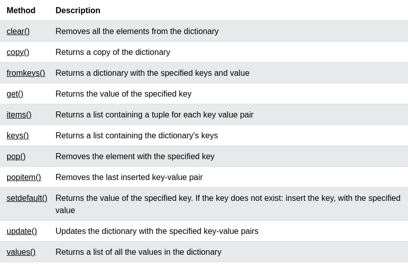

# Data archivist  

## Tuple 

* Ordered.
* Immutable.
* Could have any data type.
* Indexed.

## Set 

- Hashed.
- Unordered.
- Elements are unique .
- Unindexed .

- Takes O(1) to add, O(n) to delete as worst case .
> set [methods](https://www.w3schools.com/python/python_ref_set.asp)

 

### Intersection, union, difference and symmetric difference

* Sets in python support several set theory operations: 
1) Union: combine between two sets or more.
2) Diff: Elements that exists and a single sets but not the other. 
3) Symmetric diff: Elements that exists uniquely from two sets without the intersection (similar).
4) Intersection: common elements between 2 sets or more. 

## Random 

* `random.sample(data, number of elements)` : a unique list of elements from a data (list, set ,...). It chooses each element at most once.
* `random.randint(min, max)`: choose a number between min and max  (included)

## Dictionary 

* Like hash map in C++, Java
* Hashed Key, value pair
* Take O(1) to add, delete, update

> All dict [methods](https://www.w3schools.com/python/python_ref_dictionary.asp)

