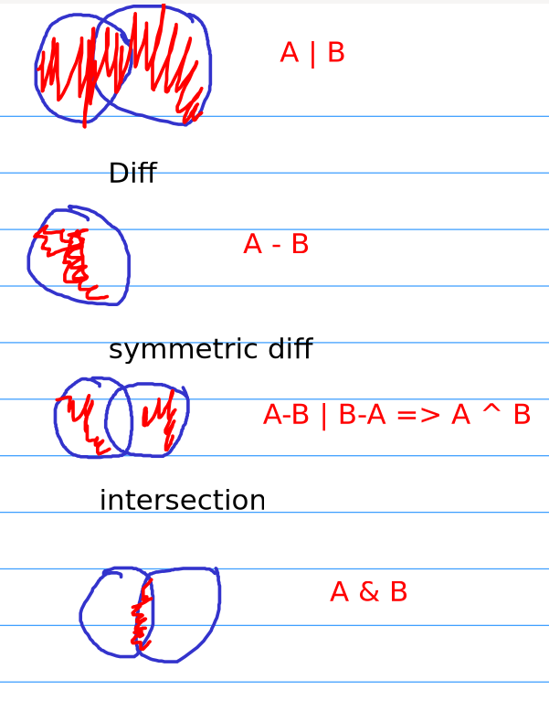

# Data archivist  

* This project made to learn in-depth about python DS.


* Each exercise discussed different topic:

  -  ex0: The use of `sys.argv` list.
  - ex1: **Advanced list operations and methods**.
  - ex2: **Tuples** .
  - ex3: **Set operations and methods**.
  - ex4: **Dictionaries**.
  - ex5: **Generators in python**.
  - ex6: **List comprehension**.

## Tuple 

> [tuple methods](https://www.w3schools.com/python/python_ref_tuple.asp)
* Ordered.
* Immutable.
* Could have any data type.
* Indexed.

## Set 

> set [methods](https://www.w3schools.com/python/python_ref_set.asp)
- Hashed.
- Unordered.
- Elements are unique .
- Unindexed .

- Takes O(1) to add, O(n) to delete as worst case .


 


### Intersection, union, difference and symmetric difference in sets

* Sets in python support several set theory operations: 
1) Union: combine between two sets or more.
2) Diff: Elements that exists and a single sets but not the other. 
3) Symmetric diff: Elements that exists uniquely from two sets without the intersection (similar).
4) Intersection: common elements between 2 sets or more. 




## Random 

* `random.sample(data, number of elements)` : a unique list of elements from a data (list, set ,...). It chooses each element at most once.
* `random.randint(min, max)`: choose a number between min and max  (included)


## Dictionary 

> All dict [methods](https://www.w3schools.com/python/python_ref_dictionary.asp)
* Like hash map in C++, Java
* Hashed Key, value pair
* Take O(1) to add, delete, update

## Generations 

- Any function uses yield, become a generator function when called.
- Calling it does not execute it immediately — it returns a generator object.
- Make data stream on the fly instead of saving them in memory.
- Generators produce values lazily (on demand), instead of storing everything in memory.
- Execution is paused at each yield and resumes from there on the next call.
- It saves the status for each call (local var, current pos, call stack), when resumed (with `next()`) it continues from where it left off.
- A generator remembers its state between yields, not per function call.
- It’s one generator instance that keeps its evolving state across resumptions.
```python 
gen1 = my_generator()
gen2 = my_generator() 
# These are two different instances
```
- Two ways to use generator functions:
  
  1) `next(gen)`
  2) `for i in generator_function()` -> the `for` loop calls `next()` repeatedly on the generator object.

      `yield` makes the function return a generator object, and a generator objects always iterable.

* When the functions end, and the yields can't return anything, python raises `StopIteration` error.
> When using typing -> typing.Generator[yield return , send_type, return_type]


